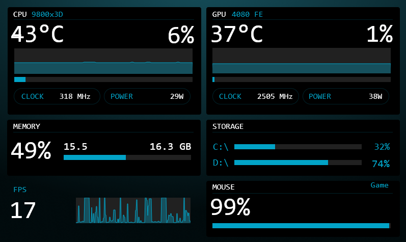

# Swiftpoint Battery for InfoPanel

An [InfoPanel](https://github.com/habibrehmansg/infopanel) plugin that shows your **Swiftpoint Z3**'s battery level, charging state, connection type and active X1 profile on your desk display.



*The MOUSE tile (bottom right) shows battery % and the active X1 profile.*

> Unofficial community plugin. Not affiliated with or endorsed by Swiftpoint.

## What it shows

| Sensor | Type | Example |
|---|---|---|
| Device | Text | `Swiftpoint Z3` |
| Battery | Number (%) | `93` - works with InfoPanel bars, gauges and text |
| Charging | Text | `Charging`, `Full`, or blank when on battery |
| Connection | Text | `SwiftLink`, `USB`, `Bluetooth`, `Disconnected`, `X1 not running` |
| Profile | Text | `Game` - the active X1 profile |
| Status | Text | `Last report 21:26:49`, or a setup hint if something's missing |

The battery updates whenever the mouse reports a change (typically every 1%), and the connection updates as soon as you plug in the cable, switch to Bluetooth, or turn the mouse off.

## Requirements

- Windows 10 or 11
- [InfoPanel](https://github.com/habibrehmansg/infopanel) with plugin support
- [Swiftpoint X1 Control Panel](https://www.swiftpoint.com/pages/swiftpoint-software-download) **3.1.2.0 or newer**, running in the background
- A Swiftpoint Z3 (other Swiftpoint mice may work but are untested - reports welcome)

## Install

1. **Download** `InfoPanel.SwiftpointBattery.zip` from the [latest release](../../releases/latest).
2. **Unblock the zip** before extracting (Windows marks downloaded DLLs as blocked and InfoPanel won't load them): right-click the zip, choose **Properties**, tick **Unblock**, click **OK**. Or in PowerShell:
   ```powershell
   Unblock-File "$env:USERPROFILE\Downloads\InfoPanel.SwiftpointBattery.zip"
   ```
3. **Extract** it into InfoPanel's plugin folder so you end up with
   `C:\ProgramData\InfoPanel\plugins\InfoPanel.SwiftpointBattery\InfoPanel.SwiftpointBattery.dll`
4. **Turn on X1 verbose logging** (see below - this is required).
5. **Restart InfoPanel.** The sensors appear under **Swiftpoint Battery > Swiftpoint Z3**.

### Turn on X1 verbose logging

X1 has an API, but it doesn't offer a way to read the battery (yet). X1 does log every battery report the mouse sends - but only when verbose logging is on. This is a hidden setting, so it has to be set in X1's settings file.

**Easy way:** download [`scripts/Enable-X1VerboseLogging.ps1`](scripts/Enable-X1VerboseLogging.ps1) and run:

```powershell
powershell -ExecutionPolicy Bypass -File Enable-X1VerboseLogging.ps1
```

It closes X1, sets `VerboseLogging=true` (plus `X1API=true`, which lets the plugin show your profile immediately after X1 starts), and reopens X1. Use `-NoApi` to skip the API setting, or `-Disable` to turn verbose logging back off.

**Manual way:**

1. Fully quit X1 - right-click its tray icon and exit (closing the window only hides it; X1 overwrites its settings on exit).
2. Open `%LOCALAPPDATA%\Swiftpoint X1 Control Panel\settings.ini`.
3. Change `VerboseLogging=false` to `VerboseLogging=true` and save.
4. Start X1 again.
5. Optional: in X1's options, turn on **Enable X1 API** and restart X1.

Then switch the mouse off and on once so X1 logs a fresh battery report.

## How it works

The plugin tails X1's log file at `%LOCALAPPDATA%\Swiftpoint X1 Control Panel\log.txt`, looking for lines like:

```
ZeeInterface: Battery Report Received: 93 % Charging
X1DeviceManager: "Z3 (SwiftLink)" Connected
Switching to  "Game"
```

It reads only what's been added since the last check (every 3 seconds), so it's cheap even when the log gets big. It doesn't talk to the mouse or receiver directly and doesn't interfere with X1.

A few details:

- On the USB cable, the Z3's own reports flip between Charging and Discharging while it tops off. The plugin treats the cable as the source of truth: **Charging** below 100%, **Full** at 100%.
- On wireless, a single out-of-place charging report is ignored unless it holds for 15 seconds, so the display doesn't flicker.
- The profile comes from the log; right after X1 starts (before it logs a switch) the plugin asks X1's API with `Profile Get`, if the API is enabled.

## Known limitations

- **Depends on X1's log format.** A future X1 update could change or remove these log lines. If the panel stops updating after an X1 update, open an issue.
- **Verbose logging grows the log faster** (a few MB per day with X1 always running) because X1 also logs every window focus change. See [Log trimming](#log-trimming-experimental).
- **X1 must be running.** Without it there's nothing to read; the Connection sensor shows `X1 not running`.
- **After an X1 update**, check that verbose logging is still on - the Status sensor will say so if the log has no battery data.

## Log trimming (experimental)

[`scripts/Trim-X1Log.ps1`](scripts/Trim-X1Log.ps1) removes log entries older than a given number of days. Because X1 keeps the log open, the script briefly closes X1, rewrites the log, and relaunches it (the mouse keeps working meanwhile - profiles live on the mouse).

```powershell
# See what it would remove, without changing anything
powershell -ExecutionPolicy Bypass -File scripts\Trim-X1Log.ps1 -Days 7 -DryRun

# Trim, then optionally schedule it (run from a normal, non-admin PowerShell)
powershell -ExecutionPolicy Bypass -File scripts\Trim-X1Log.ps1 -Days 7
powershell -ExecutionPolicy Bypass -File scripts\Install-TrimTask.ps1 -Days 7
```

The scheduled task runs 2 minutes after logon and daily at 4:00 AM (no catch-up runs, so it won't restart X1 mid-game). Remove it with `Unregister-ScheduledTask -TaskName 'Trim Swiftpoint X1 Log' -Confirm:$false`.

## Troubleshooting

| Symptom | Fix |
|---|---|
| Plugin doesn't appear in InfoPanel | Make sure the DLL is at `plugins\InfoPanel.SwiftpointBattery\InfoPanel.SwiftpointBattery.dll`, that the zip was unblocked, and restart InfoPanel. |
| Status says "No battery data - turn on VerboseLogging" | Verbose logging is off, or the mouse hasn't reported since it was turned on. Run the enable script, then power-cycle the mouse. |
| Connection says `X1 not running` | Start Swiftpoint X1 Control Panel. |
| Profile says `Unknown` | Switch to another window once (X1 logs a profile on focus changes), or enable the X1 API. |
| Values stopped updating after an X1 update | Re-run the enable script. If that doesn't help, open an issue with a snippet of `log.txt`. |

## Build from source

Requires the [.NET 8 SDK](https://dotnet.microsoft.com/download/dotnet/8.0) and InfoPanel installed (the project references `InfoPanel.Plugins.dll` from its install folder).

```powershell
# Build + zip + deploy to C:\ProgramData\InfoPanel\plugins (run as admin; restarts InfoPanel)
powershell -ExecutionPolicy Bypass -File package.ps1

# Build + zip only
powershell -ExecutionPolicy Bypass -File package.ps1 -NoDeploy
```

## A request for Swiftpoint

X1 already knows all of this - it just doesn't expose it. Read commands in the X1 API (`Battery Get`, `Connection Get`, `DPI Get`, `Device Info`, and ideally an event/subscribe mode) would let tools like this skip log parsing entirely. If you'd find that useful too, tell Swiftpoint.

## License

[MIT](LICENSE)
